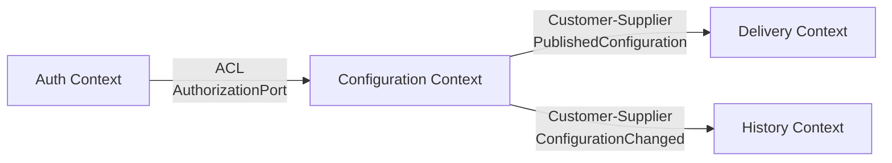

# Event Storming и карта контекстов

## Доска Event Storming

```mermaid
flowchart LR
    admin[Актор<br/>Пользователь админки]
    consumer[Внешняя система<br/>Система-потребитель]
    auth_publish[Внешняя система<br/>Auth Service]
    auth_rollback[Внешняя система<br/>Auth Service]

    create_draft[Команда<br/>Создать черновик]
    draft_created[Событие<br/>Подготовка конфигурации начата]
    configure_rollout[Команда<br/>Настроить флаг и rollout]
    rollout_configured[Событие<br/>Rollout настроен]
    publish[Команда<br/>Опубликовать конфигурацию]
    check_permission[Команда<br/>Проверить право публикации]
    permission_confirmed[Событие<br/>Право публикации подтверждено]
    validate_configuration[Команда<br/>Проверить конфигурацию]
    configuration_validated[Событие<br/>Конфигурация проверена]
    configuration_published[Событие<br/>Конфигурация опубликована]

    delivery_policy[Политика<br/>После публикации обновить раздачу]
    update_snapshot[Команда<br/>Переключить раздачу на опубликованную версию]
    snapshot_updated[Событие<br/>Раздача переключена на опубликованную версию]
    history_policy[Политика<br/>После изменения зафиксировать историю]
    record_change[Команда<br/>Зафиксировать изменение]
    change_recorded[Событие<br/>Изменение зафиксировано в истории]

    get_flags[Команда<br/>Получить флаги и конфиги]
    flags_evaluated[Событие<br/>Состояния и варианты вычислены]

    request_rollback[Команда<br/>Запросить rollback]
    check_rollback_permission[Команда<br/>Проверить право на rollback]
    rollback_permission_confirmed[Событие<br/>Право на rollback подтверждено]
    rollback[Команда<br/>Опубликовать выбранную версию]
    rollback_published[Событие<br/>Rollback опубликован]

    admin --> create_draft --> draft_created
    draft_created --> configure_rollout --> rollout_configured
    rollout_configured --> publish --> check_permission
    check_permission --> auth_publish --> permission_confirmed --> validate_configuration
    validate_configuration --> configuration_validated --> configuration_published

    configuration_published --> delivery_policy --> update_snapshot --> snapshot_updated
    configuration_published --> history_policy --> record_change --> change_recorded

    consumer --> get_flags --> flags_evaluated
    snapshot_updated -.-> get_flags

    admin --> request_rollback --> check_rollback_permission --> auth_rollback
    auth_rollback --> rollback_permission_confirmed
    rollback_permission_confirmed --> rollback --> rollback_published
    rollback_published --> delivery_policy
    rollback_published --> history_policy

    style admin fill:#FFE599,stroke:#C9A227,color:#000000
    style consumer fill:#EAD1DC,stroke:#C27BA0,color:#000000
    style auth_publish fill:#EAD1DC,stroke:#C27BA0,color:#000000
    style auth_rollback fill:#EAD1DC,stroke:#C27BA0,color:#000000
    style delivery_policy fill:#EAD1DC,stroke:#C27BA0,color:#000000
    style history_policy fill:#EAD1DC,stroke:#C27BA0,color:#000000
    style create_draft fill:#9FC5E8,stroke:#3D85C6,color:#000000
    style configure_rollout fill:#9FC5E8,stroke:#3D85C6,color:#000000
    style publish fill:#9FC5E8,stroke:#3D85C6,color:#000000
    style check_permission fill:#9FC5E8,stroke:#3D85C6,color:#000000
    style validate_configuration fill:#9FC5E8,stroke:#3D85C6,color:#000000
    style update_snapshot fill:#9FC5E8,stroke:#3D85C6,color:#000000
    style record_change fill:#9FC5E8,stroke:#3D85C6,color:#000000
    style get_flags fill:#9FC5E8,stroke:#3D85C6,color:#000000
    style request_rollback fill:#9FC5E8,stroke:#3D85C6,color:#000000
    style check_rollback_permission fill:#9FC5E8,stroke:#3D85C6,color:#000000
    style rollback fill:#9FC5E8,stroke:#3D85C6,color:#000000
    style draft_created fill:#F6B26B,stroke:#E69138,color:#000000
    style rollout_configured fill:#F6B26B,stroke:#E69138,color:#000000
    style permission_confirmed fill:#F6B26B,stroke:#E69138,color:#000000
    style configuration_validated fill:#F6B26B,stroke:#E69138,color:#000000
    style configuration_published fill:#F6B26B,stroke:#E69138,color:#000000
    style snapshot_updated fill:#F6B26B,stroke:#E69138,color:#000000
    style change_recorded fill:#F6B26B,stroke:#E69138,color:#000000
    style flags_evaluated fill:#F6B26B,stroke:#E69138,color:#000000
    style rollback_permission_confirmed fill:#F6B26B,stroke:#E69138,color:#000000
    style rollback_published fill:#F6B26B,stroke:#E69138,color:#000000
```

Основные кластеры:

- Управлению конфигурацией: подготовка, проверка, rollout, публикация и rollback
- Раздача: переключение раздачи и вычисление состояний
- История: фиксация изменения
- Авторизация: проверка прав на публикацию и rollback

## Bounded Context

| Контекст              | Единый язык                                                                        | Собственные данные                                            |
| --------------------- | ---------------------------------------------------------------------------------- | ------------------------------------------------------------- |
| Configuration Context | Flag, Draft, Config Schema, Rollout Rule, Variant, Configuration Version, Rollback | Флаги, JSON-схемы, черновики, полные версии и правила rollout |
| Delivery Context      | Published Snapshot, Evaluation Context, Flag State, Variant                        | Копия активной версии и кеш результатов                       |
| History Context       | Change Record, Action, Actor, Version Reference                                    | Записи об изменениях: действие, автор, время и номер версии   |
| Auth Context          | Admin User, Role, Permissions                                                      | Пользователи админки, роли и права                            |

## Context Map

## Сверка с предыдущей декомпозицией

Границы совпали с [предыдущим заданием](03-service-decomposition.md):

- Configuration Context соответствует `Configuration Service`;
- Delivery Context соответствует `Delivery Service`;
- History Context соответствует `History Service`;
- Auth Context соответствует внешнему `Auth Service`.

Event Storming не добавил новых границ, но уточнил уже имеющиеся сервисы из прошлого дз
