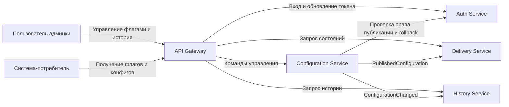

# API Gateway и BFF

## Клиенты и сценарии

- Пользователь админки создаёт и редактирует флаги, настраивает rollout, публикует и откатывает конфигурации, смотрит историю изменений.
- Система-потребитель запрашивает состояния флагов, варианты экспериментов и JSON-конфиги для конкретного пользователя.

## Решение

Для платформы нужен API Gateway, но отдельный BFF не нужен. Админка одна, и сложной агрегации данных специально под неё нет, API для неё сделано отдельное. Она может обращаться к API управления и истории через общий шлюз.
Если появятся другие интерфейсы со своим набором данных, решение по BFF можно будет пересмотреть.

## Что делает шлюз

- принимает внешние HTTPS-запросы
- проверяет авторизационный токен админки и передаёт сведения о пользователе дальше
- направляет запрос в нужный сервис
- ограничивает частоту запросов отдельно для API чтения и админки
- задаёт таймауты и повторяет только безопасные запросы чтения
- добавляет идентификатор запроса и пишет логи обращений

## Схема

