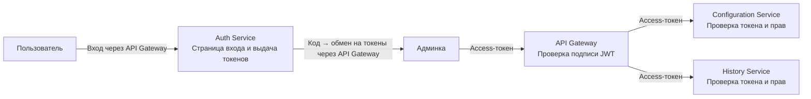

# Аутентификация и авторизация

## Роли и доступ к данным

Наблюдателю и редактору доступ назначается на конкретные конфигурации — наборы
флагов и JSON-конфигов. Администратор имеет доступ ко всей платформе.

| Роль                        | Что делает                                                                                                                | Какие данные видит                                               |
| --------------------------- | ------------------------------------------------------------------------------------------------------------------------- | ---------------------------------------------------------------- |
| Наблюдатель (только чтение) | Смотрит флаги, конфиги, черновики, версии и историю, ничего не меняет                                                     | Все данные доступных конфигураций                                |
| Редактор                    | Создаёт, редактирует и удаляет флаги и JSON-конфиги, настраивает rollout и эксперименты, публикует и откатывает изменения | Все данные доступных конфигураций                                |
| Администратор               | Работает со всеми конфигурациями, управляет пользователями и их правами                                                   | Все конфигурации и их историю, учётные записи и назначения ролей |

Система-потребитель использует отдельный ключ API. Он разрешает только получать
состояния флагов, варианты и JSON-конфиги из заданных конфигураций, без черновиков
и истории. Ключ хранится на сервере потребителя, а не в браузере.

## Вход и проверка токена

Пользователь входит через `Auth Service` по OIDC с PKCE. Он же выдаёт токены.
Запросы админки проходят через API Gateway.

API Gateway и сервисы проверяют подпись JWT, разрешённый алгоритм, срок действия,
издателя и адресата. Для запросов к API используется access-токен.

Токены хранятся только в памяти вкладки, без localStorage и sessionStorage.
После перезагрузки страницы вход выполняется заново.

Access-токен действует 5 минут. `Auth Service` заменяет refresh-токен при каждом
обновлении и отзывает его при выходе. Админка при выходе удаляет токены и данные
пользователя из памяти.

## Модель авторизации

Правило проекта: редактор может публиковать и откатывать флаги в доступных
конфигурациях, но выдавать доступ и менять роли может только администратор.

Поэтому выбран RBAC: права разделены по трём задачам — просмотр, работа с флагами
и управление платформой. Каждой соответствует своя роль.

`Auth Service` хранит роли наблюдателя и редактора для каждой конфигурации,
а роль администратора — для всей платформы.
`Configuration Service` и `History Service` при каждом запросе получают от него
актуальные права и решают, разрешена ли операция. Если проверить права не удалось,
запрос отклоняется.

## Проверка доступа и принадлежности объектов

| Операция                                                               | Что проверяется                                                                   | Где                     |
| ---------------------------------------------------------------------- | --------------------------------------------------------------------------------- | ----------------------- |
| Просмотр флага, конфига, черновика или версии                          | Объект относится к доступной конфигурации                                         | `Configuration Service` |
| Создание, изменение или удаление флага и конфига, сохранение черновика | Есть право редактирования; существующий объект относится к выбранной конфигурации | `Configuration Service` |
| Публикация                                                             | Есть право редактирования; черновик относится к выбранной конфигурации            | `Configuration Service` |
| Откат                                                                  | Есть право редактирования; старая версия относится к выбранной конфигурации       | `Configuration Service` |
| Просмотр истории                                                       | Запись относится к доступной конфигурации; список содержит только такие записи    | `History Service`       |
| Управление пользователями и ролями                                     | Есть роль администратора платформы                                                | `Auth Service`          |
| Получение состояний и конфигов потребителем                            | Ключ API действителен и разрешает чтение выбранной конфигурации                   | `Delivery Service`      |
