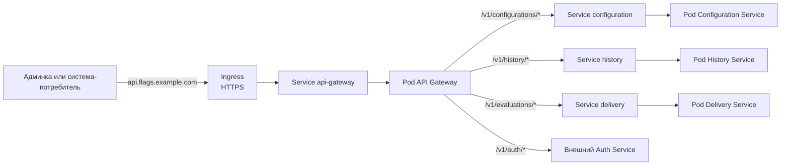

# Размещение платформы в Kubernetes

## Deployment и Service

| Компонент             | Deployment      | Service         |
| --------------------- | --------------- | --------------- |
| API Gateway           | `api-gateway`   | `api-gateway`   |
| Configuration Service | `configuration` | `configuration` |
| Delivery Service      | `delivery`      | `delivery`      |
| History Service       | `history`       | `history`       |

`Auth Service` — внешняя зависимость.

## Вход через Ingress

## ConfigMap и Secret

| Куда        | Что поместить                                                         |
| ----------- | --------------------------------------------------------------------- |
| `ConfigMap` | Адреса сервисов и уровень логирования                                 |
| `Secret`    | Пароли к базам данных и `RabbitMQ`, ключ и сертификат TLS для Ingress |

## Состояние и готовность

| Данные                                      | Где хранятся                 |
| ------------------------------------------- | ---------------------------- |
| Черновики и версии                          | База `Configuration Service` |
| История изменений                           | База `History Service`       |
| Активная версия и отметки обработки событий | База `Delivery Service`      |
| Очереди сообщений                           | `RabbitMQ` вне Pod сервисов  |

Базы сервисов и `RabbitMQ` используют долговременное хранилище, не связанное
с жизнью Pod.
Кеш ответов `Delivery Service` остаётся в памяти Pod: после пересоздания он
заполняется заново при запросах. Активная версия при этом хранится в базе.
Пока проба готовности (`readinessProbe`) не прошла, `Service` не направляет
запросы в Pod:

| Pod                     | Когда готов                           |
| ----------------------- | ------------------------------------- |
| API Gateway             | Маршруты загружены                    |
| `Configuration Service` | Доступна его база                     |
| `History Service`       | Доступна его база                     |
| `Delivery Service`      | Активная версия загружена из его базы |
