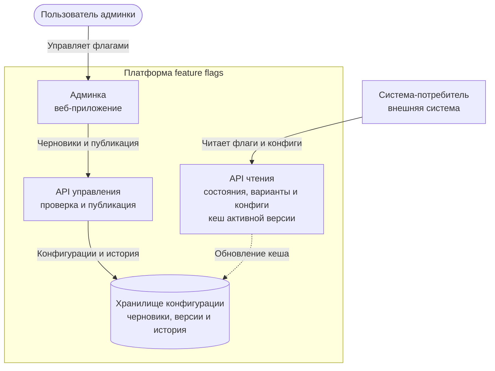

# C4, уровень 2 — контейнеры

## Контейнеры

- **Админка** — настройка флагов, JSON-конфигов, rollout и rollback.
- **API управления** — проверка прав и типов, публикация версий, rollback и
  запись истории изменений.
- **Хранилище конфигурации** — черновики, опубликованные версии и история
  изменений.
- **API чтения** — вычисление состояний и вариантов, а также выдача
  JSON-конфигов из кеша активной версии.

Запросы потребителей поступают только в API чтения. При обработке запроса оно не
обращается к админке, API управления или хранилищу. Хранилище используется
только при обновлении активной версии в кеше.
