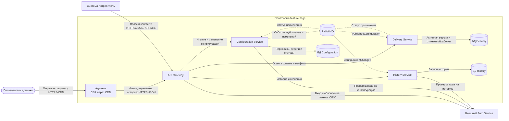

# C4, уровень 2 — контейнеры

```mermaid
flowchart LR
    admin_user([Пользователь админки])
    consumer[Система-потребитель]
    auth[Внешний Auth Service]

    subgraph platform[Платформа feature flags]
        admin[Админка<br/>CSR через CDN]
        gateway[API Gateway]
        configuration[Configuration Service]
        delivery[Delivery Service]
        history[History Service]
        broker[(RabbitMQ)]
        configuration_db[(БД Configuration)]
        delivery_db[(БД Delivery)]
        history_db[(БД History)]
    end

    admin_user -->|Открывает админку: HTTPS/CDN| admin
    admin -->|Флаги, черновики, история: HTTPS/JSON| gateway
    consumer -->|Флаги и конфиги: HTTPS/JSON, API-ключ| gateway

    gateway -->|Чтение и изменение конфигураций| configuration
    gateway -->|История изменений| history
    gateway -->|Оценка флагов и конфиги| delivery
    gateway -->|Вход и обновление токена: OIDC| auth
    configuration -->|Проверка прав на конфигурацию| auth
    history -->|Проверка прав на историю| auth

    configuration -->|Черновики, версии и статусы| configuration_db
    delivery -->|Активная версия и отметки обработки| delivery_db
    history -->|Записи истории| history_db

    configuration -.->|События публикации и изменений| broker
    broker -.->|PublishedConfiguration| delivery
    broker -.->|ConfigurationChanged| history
    delivery -.->|Статус применения| broker
    broker -.->|Статус применения| configuration
```

Сплошная стрелка — запрос с ожиданием ответа, пунктирная — сообщение через
`RabbitMQ`.

| Связь                                                                 | При таймауте или отсутствии подтверждения                                       |
| --------------------------------------------------------------------- | ------------------------------------------------------------------------------- |
| Пользователь → админка                                                | Браузер показывает ошибку загрузки.                                             |
| Админка → API Gateway                                                 | Запрос завершается ошибкой; запись автоматически не повторяется.                |
| Система-потребитель → API Gateway                                     | Запрос завершается ошибкой; значения по умолчанию выбирает система-потребитель. |
| API Gateway → Configuration Service / History Service                 | Шлюз возвращает ошибку запроса.                                                 |
| API Gateway → Delivery Service                                        | Шлюз повторяет безопасное чтение, затем возвращает ошибку.                      |
| API Gateway → Auth Service                                            | Вход или обновление токена недоступны.                                          |
| Configuration Service / History Service → Auth Service                | Операция не выполняется: права не подтверждены.                                 |
| Configuration Service → своя БД                                       | Результат записи не подтверждён.                                                |
| Delivery Service → своя БД                                            | Новая версия не становится активной.                                            |
| History Service → своя БД                                             | Операция не подтверждена.                                                       |
| Configuration Service / Delivery Service → RabbitMQ                   | Отправка сообщения повторяется.                                                 |
| RabbitMQ → Delivery Service / History Service / Configuration Service | Если обработка не подтверждена, сообщение доставляется повторно.                |

У каждого сервиса своя база. Полная опубликованная версия приходит в
`Delivery Service` через событие; при запросе флага сервис не обращается к
`Configuration Service`.
