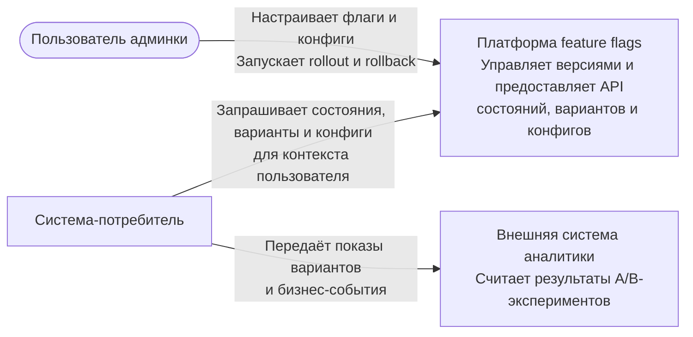

# C4, уровень 1 — контекст системы

Платформа отвечает за управление флагами, проверку типизированных JSON-конфигов
и стабильное назначение вариантов. Система-потребитель передаёт стабильный
идентификатор и контекст пользователя. Идентификация пользователей и расчёт
результатов экспериментов остаются за границей платформы.
