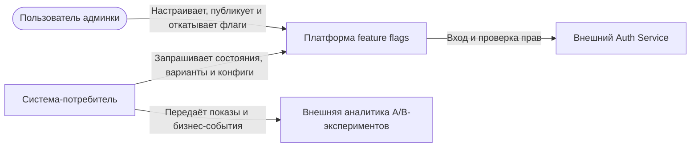

# C4, уровень 1 — контекст системы

```mermaid
flowchart LR
    admin_user([Пользователь админки])
    consumer[Система-потребитель]
    platform[Платформа feature flags]
    auth[Внешний Auth Service]
    analytics[Внешняя аналитика A/B-экспериментов]

    admin_user -->|Настраивает, публикует и откатывает флаги| platform
    consumer -->|Запрашивает состояния, варианты и конфиги| platform
    platform -->|Вход и проверка прав| auth
    consumer -->|Передаёт показы и бизнес-события| analytics
```

Платформа проверяет конфиги и назначает варианты. Результаты экспериментов
считает внешняя аналитика по событиям системы-потребителя.
